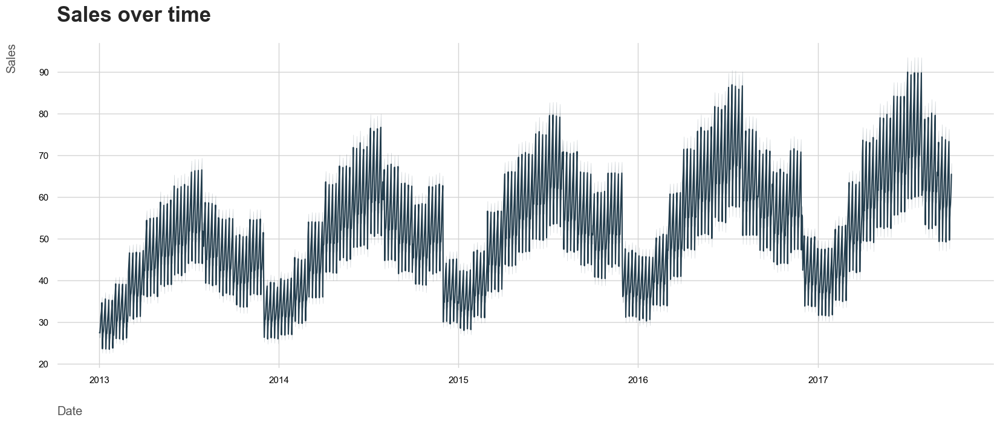
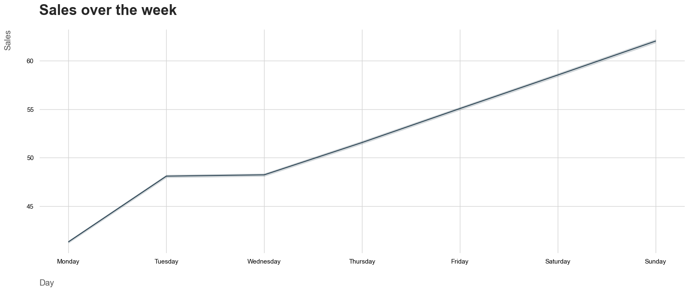
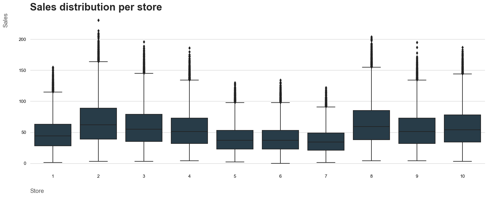
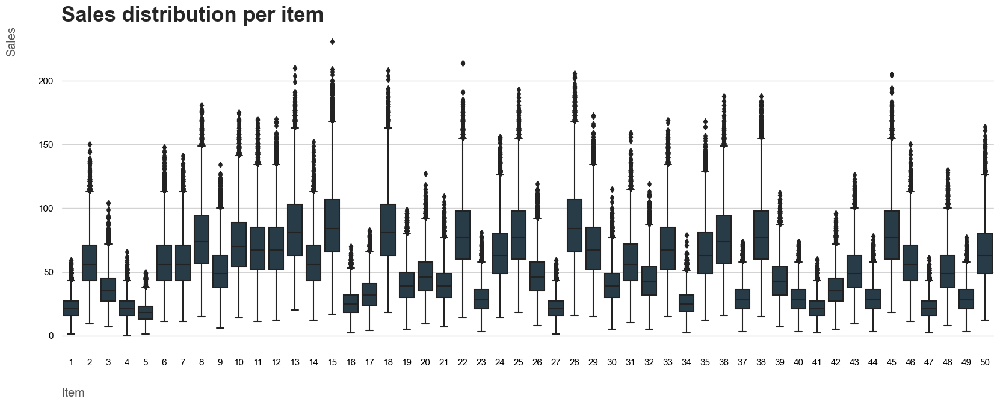
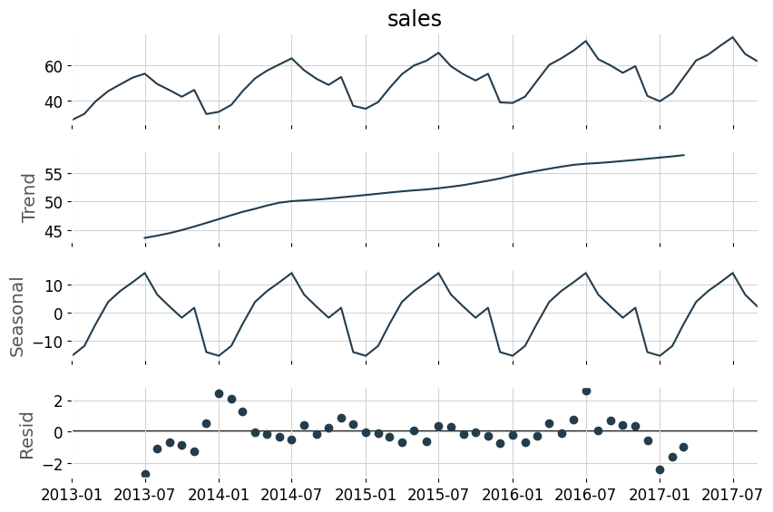
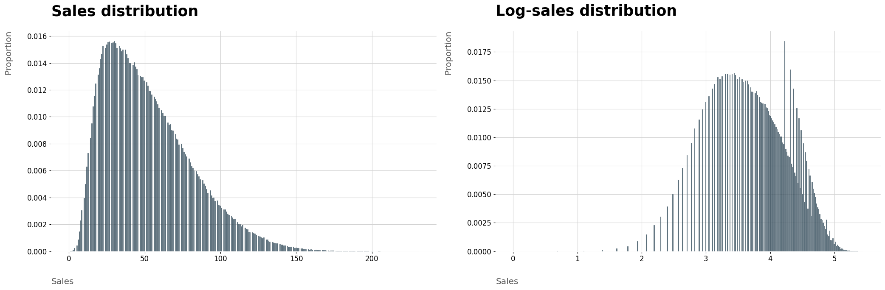
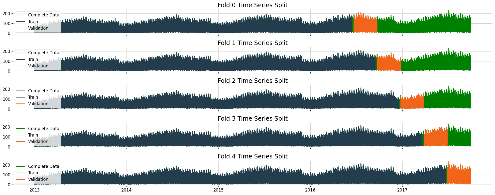
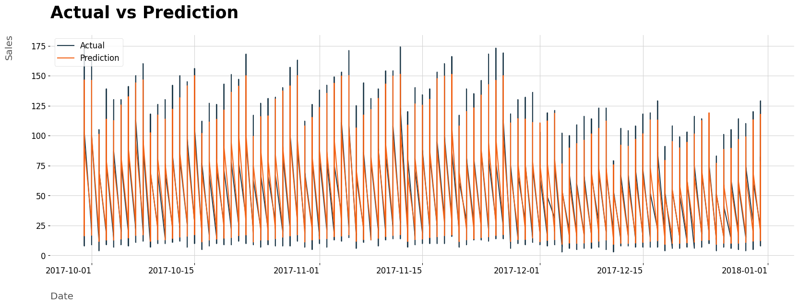
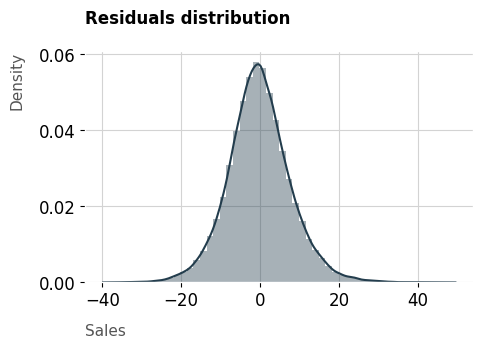
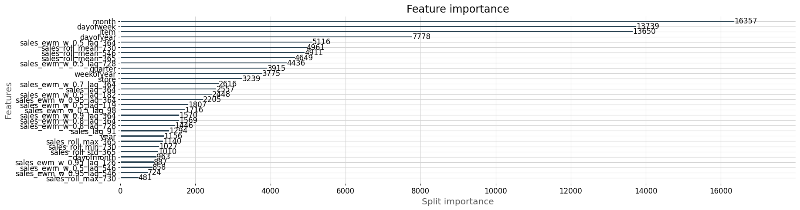

# Store Item Demand Forecasting — Time Series ML Pipeline


## Overview

Demand forecasting sits at the core of operational decision-making in retail, supply chain, and financial services. Whether a retailer is optimizing shelf inventory or a fintech company is projecting transaction volumes, the underlying challenge is the same: **how do you predict future demand accurately enough to act on it?**

This project tackles that problem using 5 years of daily sales data (2013–2017) across 10 stores and 50 items. I built an end-to-end ML pipeline using **LightGBM** that forecasts 3 months of future sales with an **R² of 0.92** and a **mean absolute error of ~6 units** against an average sale of 52 items — roughly 11.7% error. The model's predictions were translated into actionable **financial scenarios** (best-case, worst-case, and expected) at the store, item, and company level.

**Key techniques:** Time series decomposition, lag/rolling/EWM feature engineering, log transformation, Recursive Feature Elimination (RFE), Bayesian hyperparameter tuning (Optuna), SHAP explainability, and time series cross-validation with train-test gap to prevent data leakage.

---

## Table of Contents

- [Business Problem](#business-problem)
- [Tech Stack](#tech-stack)
- [Project Structure](#project-structure)
- [Approach](#approach)
  - [EDA & Time Series Decomposition](#1-eda--time-series-decomposition)
  - [Feature Engineering](#2-feature-engineering)
  - [Iterative Modelling (CRISP-DM)](#3-iterative-modelling-crisp-dm)
  - [Feature Selection & Hyperparameter Tuning](#4-feature-selection--hyperparameter-tuning)
  - [Evaluation & Explainability](#5-evaluation--explainability)
- [Results](#results)
- [Financial Impact](#financial-impact)
- [How to Run](#how-to-run)
- [Dataset](#dataset)

---

## Business Problem

A retail chain operating 10 stores with 50 product SKUs needs to forecast the next quarter's demand to make informed decisions about inventory allocation, staffing, and procurement budgets. Overstocking ties up capital; understocking loses revenue. The goal is to build a forecasting system that:

1. Captures seasonal and trend patterns in historical sales
2. Produces accurate 3-month forecasts at the store-item level
3. Quantifies prediction uncertainty so decision-makers can plan for best and worst case scenarios

This is directly transferable to fintech contexts like forecasting loan application volumes, insurance claim counts, or payment transaction loads — any domain where time-dependent demand drives resource allocation.

---

## Tech Stack

| Category | Tools |
|----------|-------|
| Language | Python 3.11 |
| Core Libraries | Pandas, NumPy, Scikit-learn, LightGBM |
| Optimization | Optuna (Bayesian hyperparameter search) |
| Explainability | SHAP |
| Time Series | Statsmodels (decomposition) |
| Visualization | Matplotlib, Seaborn |
| Environment | Anaconda, Jupyter Notebook, VS Code |
| Version Control | Git, GitHub |

---

## Project Structure

```
Store-Item-Demand-Forecasting/
├── input/                  # Raw train/test CSV data
├── models/                 # Serialized LightGBM model (.pkl)
├── notebooks/
│   ├── eda.ipynb           # Exploratory data analysis
│   └── modelling.ipynb     # Full modelling pipeline
├── reports/                # All visualizations and images
├── src/
│   ├── __init__.py
│   ├── exception.py        # Custom exception handling
│   ├── artifacts_utils.py  # Model save/load utilities
│   └── modelling_utils.py  # Feature engineering, CV, RFE, evaluation, financial estimation
├── requirements.txt        # Pinned dependencies
├── setup.py                # Package configuration
├── .gitignore
├── LICENSE
└── README.md
```

The `src/` module is designed to be reusable — `modelling_utils.py` contains sklearn-compatible transformers and functions for time series splitting, cross-validation, feature creation, recursive feature elimination, model evaluation, and financial result estimation. The project is installable as a Python package via `setup.py`.

---

## Approach

### 1. EDA & Time Series Decomposition

Before modelling, I split the data chronologically (train: up to Sept 2017, test: Oct–Dec 2017) to simulate a real production environment where the model never sees future data during development.

Key findings from the EDA:

**Sales show a clear upward trend and strong seasonality** — demand peaks around July every year and is consistently higher on Sundays.





**Store and item performance varies significantly.** Stores 2 and 8 are the highest-volume locations; stores 5, 6, and 7 are the lowest. Items 15 and 28 consistently outsell the rest.

<p>


</p>

**Time series decomposition** (additive model via Statsmodels) confirmed a non-stationary series with an increasing trend, strong seasonal components, and residuals distributed around zero.



---

### 2. Feature Engineering

I engineered 85 features from the raw date, store, and item columns:

**Date-based features:** day of week, month, quarter, year, day of year, day of month, week of year, weekend flag, month-start/end flags.

**Lag features:** Sales values shifted by 91, 98, 105, 112, 119, 126, 182, 364, 546, and 728 days — capturing weekly patterns, quarterly cycles, and multi-year trends. Lags were grouped by store-item pairs to prevent cross-contamination.

**Rolling window features:** Mean, standard deviation, min, and max over 365-, 546-, and 730-day windows (with `shift(1)` to avoid leakage and `min_periods=30` for stability).

**Exponentially weighted means (EWM):** Applied with decay weights of 0.95, 0.9, 0.8, 0.7, and 0.5 across all lag values — giving more weight to recent observations.

**Target transformation:** Applied `log1p()` to sales to correct the right-skewed distribution, improving the model's ability to capture patterns.



---

### 3. Iterative Modelling (CRISP-DM)

Instead of jumping to the best model, I followed CRISP-DM's iterative data preparation → modelling cycle. Each feature group was added incrementally, and performance was validated with **time series cross-validation** (5-fold expanding window, 3-month test size, 1-week gap between train/validation to prevent overfitting):



| Step | Features Added | Approach |
|------|---------------|----------|
| Baseline | None | DummyRegressor (mean prediction) |
| Step 1 | Date features only | LightGBM default config |
| Step 2 | + Log transform + Lag features | LightGBM |
| Step 3 | + Rolling mean | LightGBM |
| Step 4 | + Rolling std | LightGBM |
| Step 5 | + Rolling min/max | LightGBM |
| Step 6 | + Exponentially weighted means | LightGBM |

Each step showed incremental improvement, confirming that the feature engineering was genuinely adding predictive value rather than noise.

---

### 4. Feature Selection & Hyperparameter Tuning

**Recursive Feature Elimination (RFE):** Using a custom sklearn-compatible `RecursiveFeatureEliminator` transformer with time series CV, I reduced the feature set from 85 → 31 variables. The retained features were dominated by the engineered time series features (rolling means, EWMs, key lags), validating the feature engineering effort.

**Bayesian Optimization (Optuna):** Tuned `learning_rate`, `num_leaves`, `subsample`, `colsample_bytree`, and `min_data_in_leaf` over 30 trials using time series cross-validation as the objective. Final model used 1,000 estimators.

---

### 5. Evaluation & Explainability

**Model Performance:**

|  | Model | MAE | MAPE (%) | RMSE | R² |
|--|-------|-----|----------|------|----|
| Test Set | LightGBM | 6.10 | 13.29 | 7.97 | 0.922 |

Train, validation, and test RMSE scores were all similar, confirming **no overfitting** and good generalization.

**Sample predictions on the test set:**

| Date | Actual Sales | Predicted | Error |
|------|-------------|-----------|-------|
| 2017-10-14 | 100 | 92.3 | 7.7 |
| 2017-12-13 | 17 | 19.4 | 2.4 |
| 2017-11-09 | 101 | 96.2 | 4.8 |
| 2017-11-06 | 16 | 15.8 | 0.2 |
| 2017-12-14 | 50 | 51.9 | 1.9 |

**Actual vs. Predicted over the 3-month forecast period:**



**Residuals are normally distributed around zero**, satisfying a key regression assumption:



**SHAP Analysis** — the two-year, 18-month, and one-year rolling sales means are the most influential features. Seasonality features (month, day of week) and exponentially weighted means also rank highly. This aligns with the EDA findings on trend and seasonality.



---

## Results

The final LightGBM model forecasts 3 months of daily sales for 500 store-item combinations with:

- **R² = 0.922** — the model explains 92.2% of sales variance
- **MAE = 6.1 units** — predictions are off by ~6 items on average (target mean is 52.25)
- **MAPE = 13.3%** — percentage error across all predictions
- Model correctly captures higher sales on weekends, July peaks, and store/item-level differences
- Higher prediction errors occur at extreme sales values (rapid demand spikes), which is expected behavior

---

## Financial Impact

The model's predictions were converted into financial scenarios to support inventory planning. Below are the forecasted 3-month sales per store, including uncertainty bounds derived from the model's daily MAE:

| Store | Total Predicted Sales | Avg Daily Sales | Daily MAE | Worst Case (Daily) | Best Case (Daily) | Worst Case (Total) | Best Case (Total) |
|-------|-----------------------|-----------------|-----------|--------------------|--------------------|---------------------|-------------------|
| 1 | 232,105 | 2,496 | 56 | 2,440 | 2,552 | 226,910 | 237,299 |
| 2 | 326,805 | 3,514 | 70 | 3,444 | 3,584 | 320,337 | 333,274 |
| 3 | 290,955 | 3,129 | 65 | 3,064 | 3,193 | 284,937 | 296,974 |
| 4 | 269,450 | 2,897 | 62 | 2,836 | 2,959 | 263,715 | 275,186 |
| 5 | 195,448 | 2,102 | 54 | 2,048 | 2,156 | 190,434 | 200,463 |
| 6 | 194,993 | 2,097 | 50 | 2,046 | 2,147 | 190,302 | 199,684 |
| 7 | 178,348 | 1,918 | 43 | 1,874 | 1,961 | 174,320 | 182,377 |
| 8 | 313,747 | 3,374 | 62 | 3,311 | 3,436 | 307,954 | 319,540 |
| 9 | 270,084 | 2,904 | 66 | 2,838 | 2,970 | 263,922 | 276,247 |
| 10 | 288,062 | 3,097 | 71 | 3,027 | 3,168 | 281,491 | 294,632 |

**Example interpretation:** Store 2 is forecasted to sell ~326,800 items over the next quarter, averaging 3,514 items/day. Accounting for model uncertainty (±70 items/day), the 3-month total ranges between 320,337 and 333,274 units.

**Company-wide forecast:**

| Total Predicted Sales | Avg Daily Sales | Daily MAE | Worst Case (Total) | Best Case (Total) |
|-----------------------|-----------------|-----------|---------------------|-------------------|
| 2,559,998 | 27,527 | 404 | 2,522,455 | 2,597,542 |

The company is expected to sell approximately **2.56 million items** over the next quarter. These forecasts, broken down to the store-item level, enable targeted decisions about which stores need more inventory (stores 2, 3, 8) and which items to prioritize (items 15 and 28).

---

## How to Run

**Prerequisites:** Python 3.11+, pip, Git, Jupyter Notebook

```bash
# 1. Clone the repository
git clone https://github.com/Pranava31/Store-Item-Demand-Forecasting.git
cd Store-Item-Demand-Forecasting

# 2. Create and activate a virtual environment
python -m venv venv
source venv/bin/activate        # Windows: venv\Scripts\activate

# 3. Install dependencies
pip install -r requirements.txt

# 4. Launch Jupyter and open notebooks
jupyter notebook
```

Open `notebooks/eda.ipynb` for the exploratory analysis and `notebooks/modelling.ipynb` for the full pipeline.

---

## Dataset

Source: [Kaggle — Store Item Demand Forecasting Challenge](https://www.kaggle.com/competitions/demand-forecasting-kernels-only/overview)

5 years of daily sales records (913,000 rows) for 50 items across 10 stores. Clean dataset with no missing values — designed to explore time series forecasting techniques.

---

**Built by [Pranav Waghmare](mailto:waghmare.pr@northeastern.edu)** · Northeastern University · MS in Information Systems
